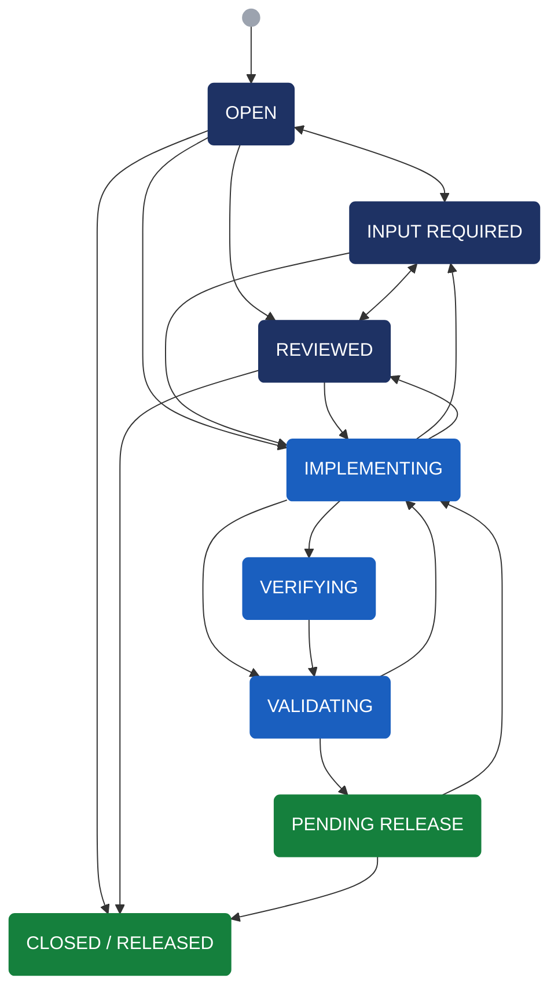
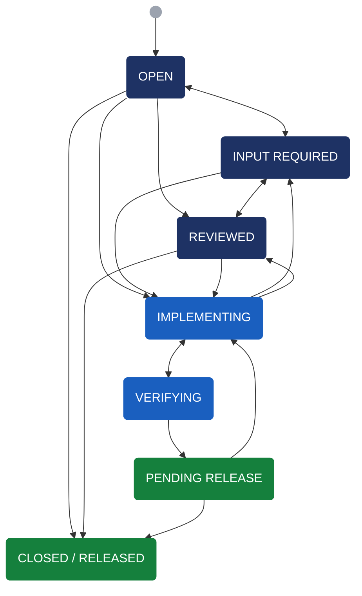
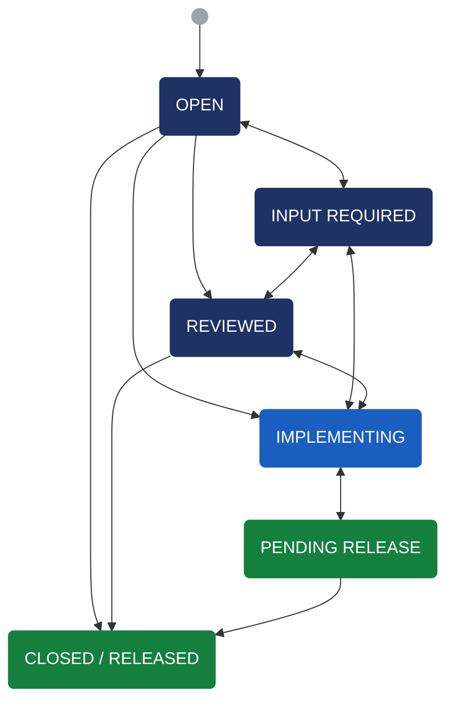

# Ticket Workflow

## PIPE: Feature/BugFix Ticket

Applies to PIPE feature, bug, and epic tickets. Engineering and Research Request tickets follow similar but simplified workflows — see below.

### States

- **Open**: Initial state of a new ticket.
- **Reviewed**: Accepted into the backlog "To-Do" list based on scientific or operational priority and available resources; not yet actively worked. Tickets targeting a specific release are labeled accordingly.
- **Input Required**: Awaiting requirements or clarifying information from a stakeholder or developer.
- **Implementing**: Actively being developed; a branch exists. Can transition to **Verifying**, directly to **Validating**, **Input Required**, or **Reviewed**.

  :::{note}
  - Open a Draft/WIP Pull Request early to allow team feedback on algorithm and implementation choices. Use a descriptive title such as `WIP: PIPE-1234: implementing bugfix for task` alongside Bitbucket's built-in draft state.
  - Maintain a clear PR description and informative inline comments to surface design questions, explain rationale, and aid both the developer and reviewer.
  :::

- **Verifying**: Assigned to other developer(s) for code review and cross-check changes before stakeholder validation. Do not advance to **Validating** until the development team is satisfied — a single code review approval is sufficient for narrow, well-scoped changes; broader changes should have wider review. A ticket may cycle through **Implementing**, **Verifying**, and **Validating** multiple times before merging.

  :::{note}
  - **Weblog storage**: Post PR testing results to the observatory's internal weblog storage so reviewers and stakeholders can assess impact without needing raw data or deep familiarity with the issue. Use `<PIPE-1234>` as the subdirectory name; weblogs and log files are typically sufficient — avoid large data files. Organize results into labeled sub-directories (e.g. `PIPE-1234/main`, `PIPE-1234/pipe1234-v1-attempt1`, `PIPE-1234/pipe1234-v2-attempt2`). Directories may be removed after the code is released.
  - **Early merge exception**: If both the stakeholder and technical lead agree, a narrow, well-scoped change may be merged into `main` after verification and before formal validation. This still requires at least one developer approval, all PR tasks resolved, and all automated tests passing. The `Validating-MAIN` label must be applied and a merge comment posted with the commit tag (e.g., `2026.1.1.1`); the ticket then advances to **Validating**, where validation occurs on `main`.
  :::
- **Validating**: Assigned to a stakeholder to validate against the ticket branch, or against `main` if the `Validating-MAIN` label is set. On acceptance, moves to **Pending Release**; if issues are found, returns to **Implementing** and may cycle through **Verifying** and **Validating** again.
- **Pending Release**: Implementation complete; branch ready to merge into `main` pending release. If unexpected issues arise after merging, the ticket can return to **Implementing**.
- **Closed / Released**: Set in bulk via the Jira bulk change tool once a software version is officially released.

## PIPE: Engineering Ticket

Covers internal infrastructure work — build system changes, CI/CD improvements, tooling, and dependency updates — with no direct scientific impact and no stakeholder validation. The **Validating** state is omitted. Minor non-production changes (documentation fixes, CI/CD updates) may be merged without formal review after contacting the technical lead for a repository permission override.

---

## PIPE: Research Request Ticket

Tracks investigative or exploratory work — data analysis, feasibility studies, or algorithm evaluations. No **Verifying** state; **Implementing** and **Pending Release** are bidirectional to support iterative research cycles.

---

## PIPEREQ: Ticket Workflow

PIPEREQ tickets follow a separate, less formalized workflow.

### States

- **In Review**: Research in progress, discussion ongoing; not yet ready for a PIPE ticket.
- **Scheduled**: Requirements converged; PIPE ticket(s) created and linked.
- **Ready to Validate**: Rarely used in practice.
- **Done**: Linked PIPE ticket(s) closed.
