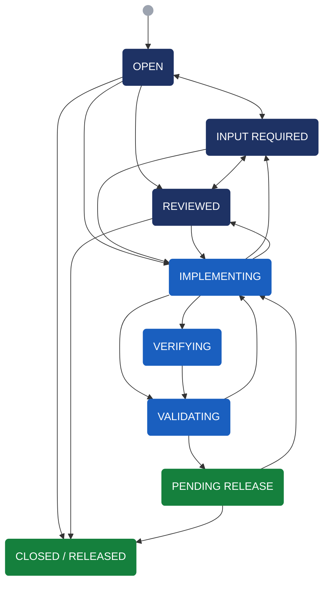
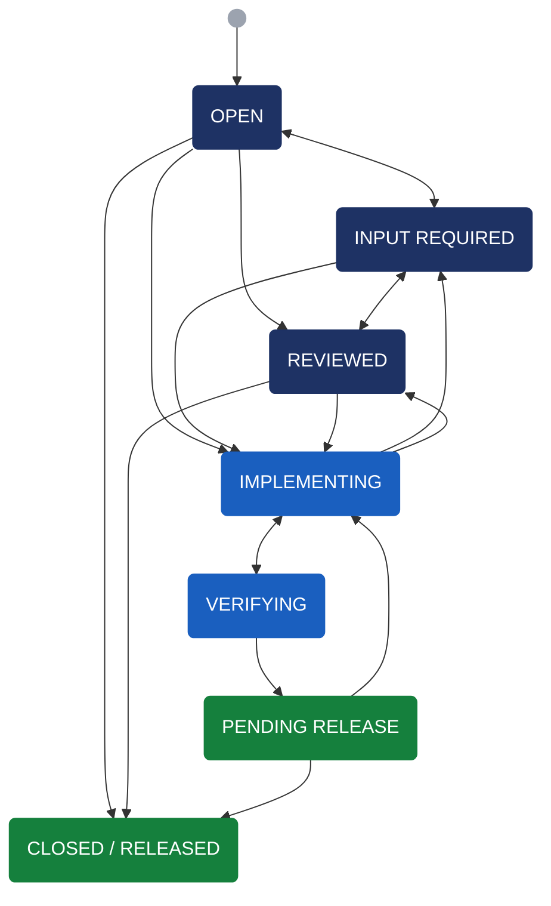
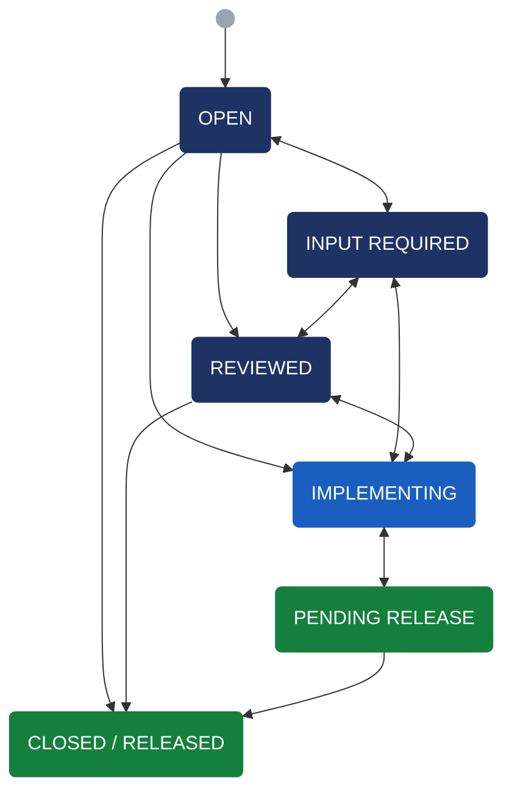
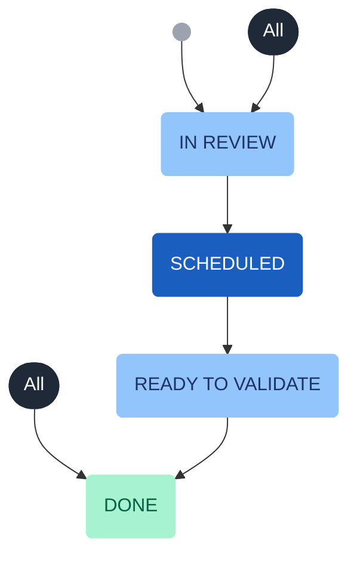

# Ticket Workflow

## PIPE: Feature/BugFix Ticket

The following workflow applies to Pipeline (PIPE) feature, bug, and epic tickets. Engineering and Research Request task tickets follow a similar but simplified workflow that omits the stakeholder validation step.

### States

- **Open**: the initial state of a new ticket.
- **Reviewed**: accepted into the backlog based on scientific or operational priority and available developer resources, but not yet actively worked. Tickets targeted for a specific release are labeled accordingly.
- **Input Required**: assigned to a stakeholder or developer to gather requirements or clarifying information.
- **Implementing**: actively being worked by a developer; a development branch exists. From this state a ticket can transition to **Verifying**, directly to **Validating** (skipping verifying), **Input Required**, or **Reviewed**.
  - A Pull Request should be opened early as a "Draft" or "Work In Progress" (WIP) to allow team members to comment on implementation choices, code style, etc. A descriptive title such as `WIP: PIPE-1234: implementing bugfix for task` is recommended.
  - A clear, up-to-date PR description and informative inline comments are strongly encouraged — they help surface design questions, explain implementation rationale, and benefit both the developer and the reviewer.
- **Verifying**: assigned to developer(s) to review and cross-check changes before handing off to stakeholders for validation.
  - The ticket should not move to **Validating** until the development team is satisfied with the implementation. Ideally, no further code changes are needed beyond this point. A ticket may cycle through **Implementing**, **Verifying**, and **Validating** multiple times before it is ready to merge.
  - Repository settings prevent merging a development branch into `main` until at least one other developer has approved the Pull Request, all open PR tasks are resolved, and all automated tests pass.
  - Developers are encouraged to post PR testing results to the observatory's internal weblog storage so that reviewers and stakeholders can easily access them.
    - Use `<PIPE-1234>` as the sub-directory name.
    - Store only what is needed for comparison — large data files should be avoided; weblogs and log files are typically sufficient.
    - Results from different branches can be organized within that sub-directory, e.g. `PIPE-1234/main`, `PIPE-1234/pipe1234-v1-attempt1`, `PIPE-1234/pipe1234-v2-attempt2`, or any other clear labeling scheme.
    - The goal is to help reviewers and stakeholders compare results and assess impact without needing the raw test data or deep familiarity with the issue — this shortens the overall development cycle.
    - This storage is intended as short- to medium-term; ticket directories may be removed after the code is released.
- **Validating**: assigned to a stakeholder for validation against the ticket branch. Once accepted, the ticket moves to **Pending Release**. If issues are found, the branch is updated and the ticket returns to **Implementing**, potentially cycling through **Verifying** and **Validating** again until ready.
- **Pending Release**: the implementation is complete and the branch is ready to merge into `main`, but the release has not yet occurred. Once all prior steps are done, the merge is straightforward. If unexpected issues arise after merging, the ticket can return to **Implementing**.
- **Closed / Released**: once a software version is officially released, all associated **Pending Release** tickets are moved to this state using the Jira bulk change tool.

## PIPE: Engineering Ticket

Engineering tickets cover internal infrastructure work — build system changes, CI/CD improvements, tooling, dependency updates, and other tasks that do not directly change scientific functionality and do not require stakeholder validation. This simplified workflow omits the **Validating** state.

---

## PIPE: Research Request Ticket

Research Request tickets track investigative or exploratory work — data analysis, feasibility studies, algorithm evaluations, or other research tasks requested by stakeholders. They follow a simplified workflow: there is no formal **Verifying** state, and the **Implementing** and **Pending Release** states are bidirectional to accommodate iterative research cycles.

---

## PIPEREQ: Ticket Workflow

PIPEREQ tickets follow a separate, more flexible workflow that is less formalized than the standard PIPE process.

### States

- **In Review**: research being done, discussion happening; not yet ready for a PIPE ticket.
- **Scheduled**: requirements converged, PIPE ticket(s) created and linked.
- **Ready to Validate**: not really used in practice.
- **Done**: when the linked PIPE ticket(s) is done.
