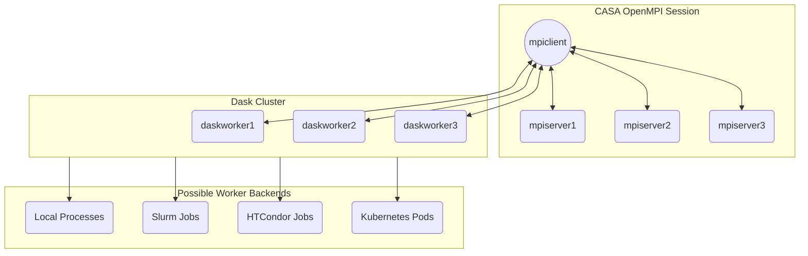
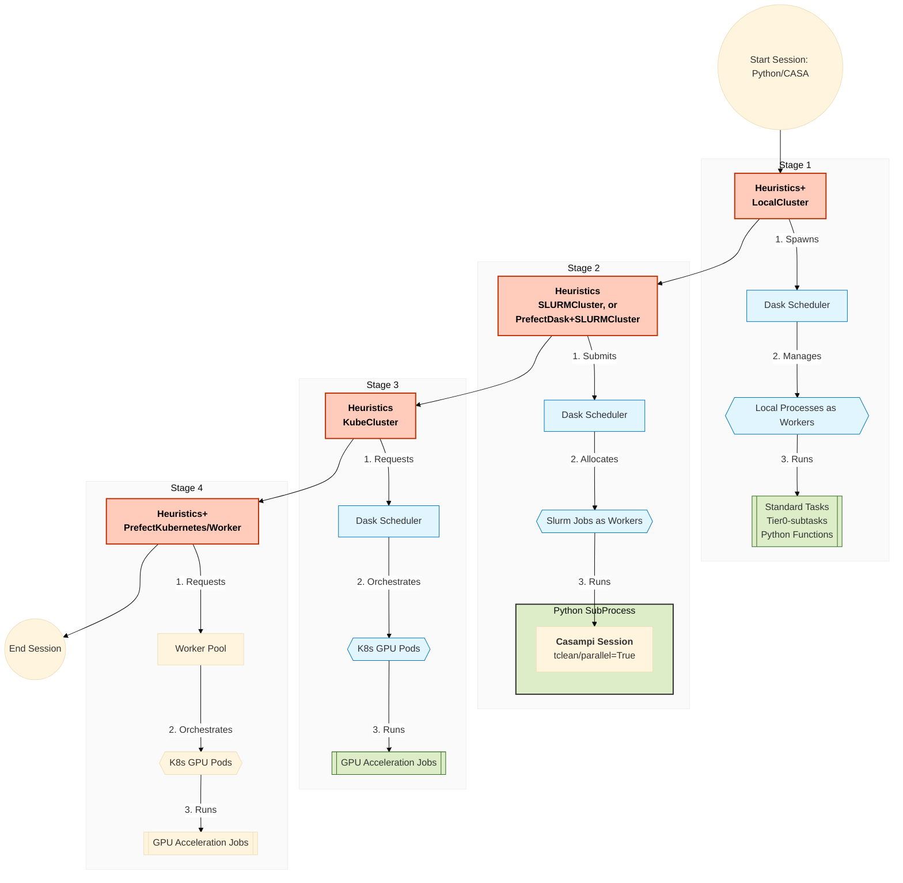

# Parallelization and DaskCluster Backend Integration in Pipeline

* [pipeline/infrastructure/mpihelpers.py](https://open-bitbucket.nrao.edu/projects/PIPE/repos/pipeline/browse/pipeline/infrastructure/mpihelpers.py) - This module contains the original `casampi`-based wrapper layer. It is used to dispatch [pipeline tasks](https://pipe-docs.readthedocs.io/en/latest/apisummary.html#pipeline-h-tasks-modules-automodapi), casatasks [jobrequest](https://open-bitbucket.nrao.edu/projects/PIPE/repos/pipeline/browse/pipeline/infrastructure/jobrequest.py), or any pickleable Python functions through `casampi` on the preallocated MPI cluster spawned from a `mpicasa` session.

* [pipeline/infrastructure/daskhelpers.py](https://open-bitbucket.nrao.edu/projects/PIPE/repos/pipeline/browse/pipeline/infrastructure/daskhelpers.py) - This module contains helper functions, including the logic for sanitizing MPI environment variables to prevent conflicts when running Dask workers within an active MPI session. It also includes utilities for creating and configuring Dask clusters with different backends (local, Slurm, HTCondor, Kubernetes) and for handling the lifecycle of the cluster in the context of the pipeline. It provides a Dask-based mechanism to dispatch pipeline tasks, casatasks `jobrequest`, or pickleable Python functions, serving as an alternative to the `casampi`-based approach in `mpihelpers.py`.

* [pipeline/config.yaml](https://open-bitbucket.nrao.edu/projects/PIPE/repos/pipeline/browse/pipeline/config/config.yaml) - The default configuration file where Dask cluster settings are defined, including parameters for different cluster types, default worker counts, and job names. A hierarchical structure configuration setup is implemented (`workdir/config.yaml`->`~/.casa/config.yaml`->`pipeline/config.yaml`) to allow for flexible overrides at different levels of the user environment. This is the current setup for Dask cluster parameters.

## Future improvement - Potential Parallelization Paradigm for Pipeline processing

## version 1 

- with traditional `mpicasa` configuration, no nested subprocess, dask clusters spawned from the mpi client process
- mpi cluster is still a fixed resource allocation.

## version 2: 

- parallelization/workflow/graphreduction handled by Dask and workflow orchestration library, 
- with nested subprocess for casampi / tclean(parallel=True) if absolutely necessary when no alternative solution exists, such as [CASA memo#13](https://casadocs.readthedocs.io/en/stable/notebooks/memo-series.html).
- data processing session reaches out to workload manager / resource manager for surged resource allocation, instead of fixed resource allocation at the start of the session.
- persisted new context design with adaptation layer to support existing pipeline framework and new parallelization/workflow paradigm.

