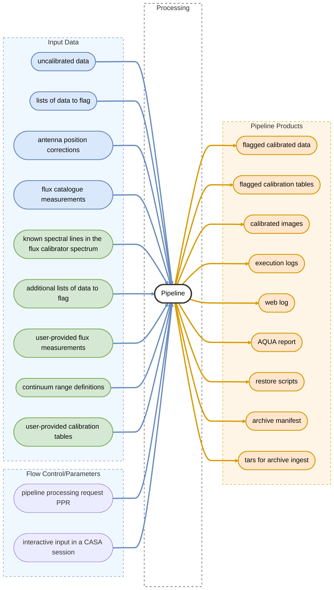

# Pipeline Overview

The Pipeline can be invoked in three ways, depending on the use case:

- **PPR XML** (production): a Pipeline Processing Request XML file specifies the data, task sequence, and processing intents. It is executed via `runpipeline.py` in a CASA session, which drives `executeppr()` in `pipeline.infrastructure.executeppr`.
- **Interactive CASA session**: tasks are called individually from the CASA prompt after importing them via `pipeline.initcli()`. This is the standard mode for development and debugging.
- **Python API**: tasks can be imported and called directly from a Python script, e.g. `from pipeline.cli import hifa_bandpass`.

## Task Namespaces

Pipeline tasks are grouped by telescope and observing mode using a prefix scheme:

| Prefix | Module | Scope |
|--------|--------|-------|
| `h_` | `pipeline/h/` | Generic (all modes): `h_init`, `h_save`, `h_resume`, `h_weblog` |
| `hif_` | `pipeline/hif/` | Generic interferometry |
| `hifa_` | `pipeline/hifa/` | ALMA interferometry |
| `hifv_` | `pipeline/hifv/` | VLA interferometry |
| `hsd_` | `pipeline/hsd/` | ALMA single-dish |
| `hsdn_` | `pipeline/hsdn/` | Nobeyama single-dish |

## Session Lifecycle

A pipeline session is built around a **Context** object, which holds all state (domain data, calibration tables, results, directory paths) across tasks. It is persisted to disk as a `.context` pickle file after each task.

A typical session follows this pattern:

```python
h_init()               # create a new Context; opens a pipeline session
hifa_importdata(...)   # load raw data into the Context
hifa_flagdata(...)     # each task reads and updates the Context
# ... further tasks ...
hifa_exportdata(...)   # write final products
h_save()               # persist the Context to disk
```

The Context is an implicit input to every task: each task's `Inputs` object is
initialised with the current Context (via `Inputs.create_from_context(context)`),
giving tasks read access to all prior results, calibration state, and domain
data, without the user needing to pass it explicitly on the command line.

An interrupted session can be resumed with `h_resume()`, which restores the last saved Context.

In practice, pipeline runs are launched in one of two ways:

- **PPR XML** (production): a Pipeline Processing Request XML file drives the full task sequence automatically — this is how pipeline runs are triggered at observatory processing centers.
- **Script replay**: each completed run produces a `casa_pipescript.py` that can be re-executed or edited to reproduce or modify the run.

For full details and examples of both approaches, see {doc}`develdocmd/usage/running_pipeline`.

## Output Products and Weblog

After each task, the Pipeline renders an HTML weblog incrementally into `<output_dir>/<context_name>/html/`. The weblog entry point is `t1-1.html`. Final data products (images, calibration tables, restore scripts, archive tars, AQUA report) are written to the `products/` directory.

The weblog can be opened in a browser from a CASA session with `h_weblog()`, which starts a local HTTP server.

## Pipeline Input and Output

The following diagram illustrates the main inputs and outputs of the Pipeline processing workflow.


